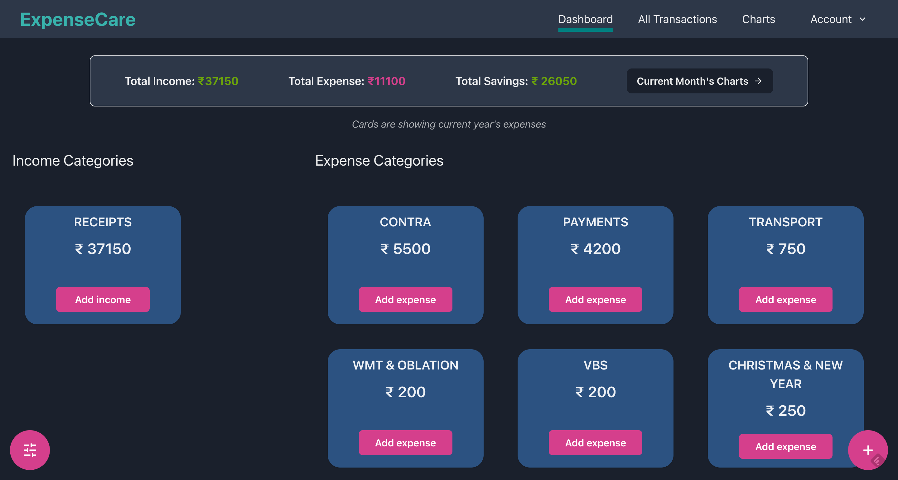
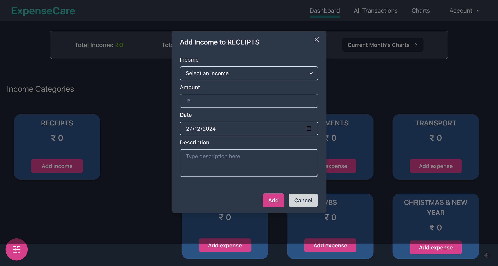
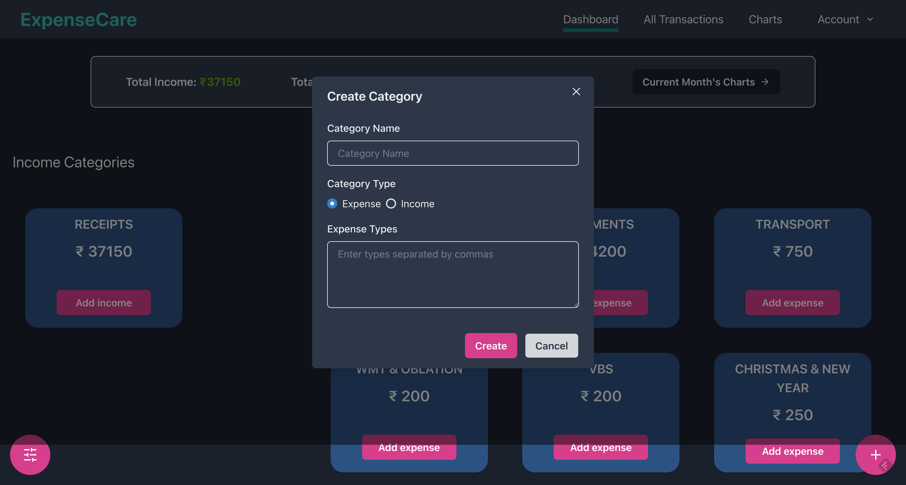
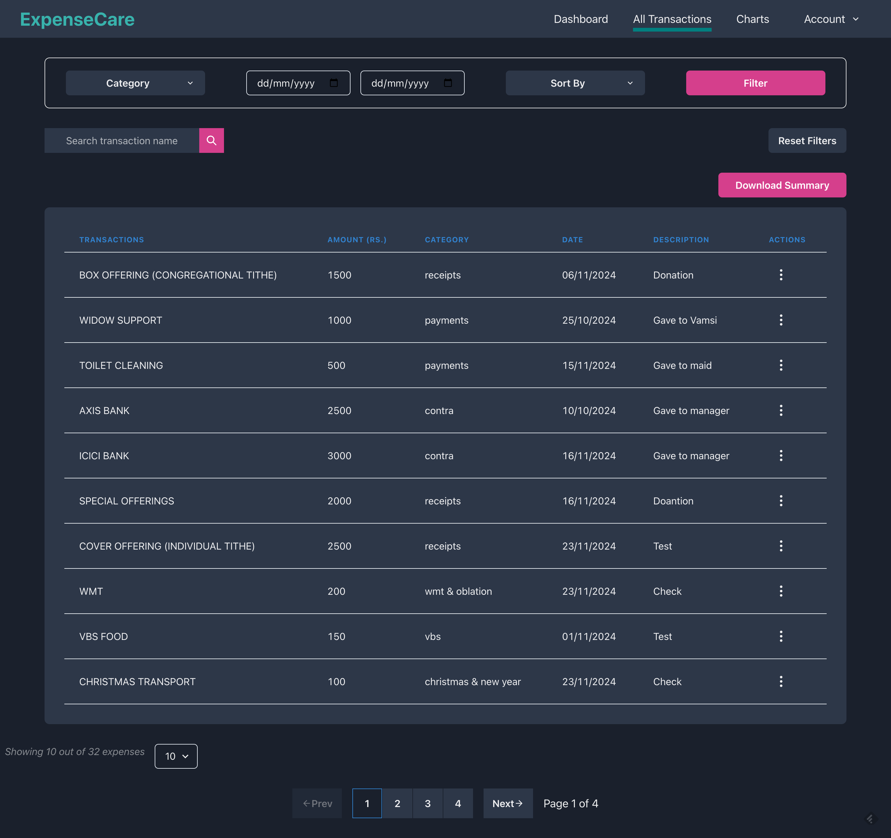
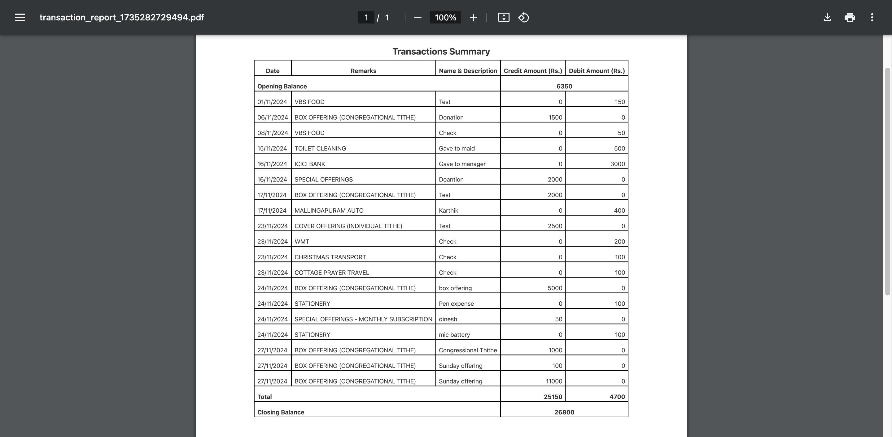
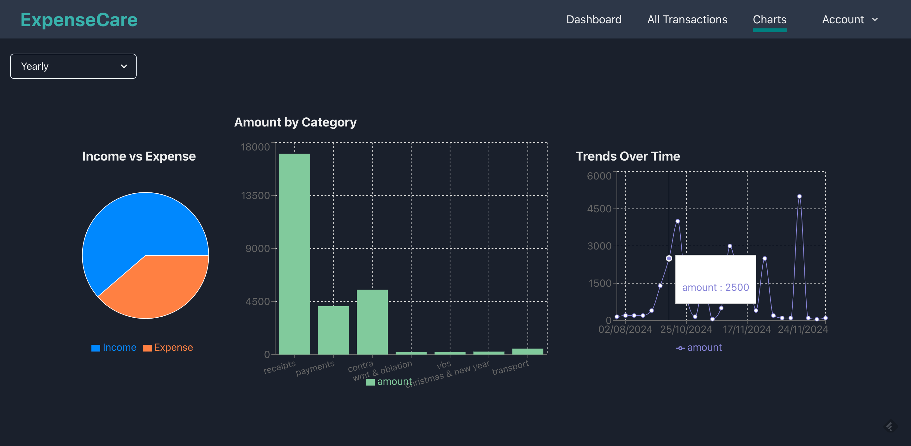

# Expense Care

**Expense Care** is an enterprise application designed to help users calculate and manage their income and expenses efficiently. The application provides a user-friendly interface and powerful features for tracking financial data.

## Features

### 1. Dashboard
- Displays **total income**, **total expenses**, and **total savings** for both monthly and yearly periods.
- Provides **category-wise totals** for income and expenses, allowing users to analyze spending habits.
- Includes a toggle option to switch between **monthly** and **yearly** data views.

    dashboard section.
  Add income/expense section.
  Add income/expense category.

### 2. All Transactions
- Lists all transactions in a detailed view.
- Includes advanced filtering options:
  - **Search by keywords**
  - **Filter by date**
  - **Filter by category**
- User can **edit and delete** transactions by clicking actions icon.
- Generates a summary based on filtered results.
- Provides the ability to generate a financial statement with **opening and closing balances** when filtering by dates.
 
 

### 3. Charts
- Displays visualizations of overall spending information, helping users understand their financial patterns at a glance.
  

## Tech Stack
- **React**: For building the user interface.
- **Chakra UI**: For a responsive and visually appealing design.
- **react-to-pdf**: For generating PDF statements and summaries.
- **Recharts**: For rendering interactive and insightful charts.
- **Appwrite**: For database and business logic.

## Getting Started

### Prerequisites
Ensure you have the following installed:
- Node.js (version 18 or above)
- npm or yarn

### Installation
1. Clone the repository:
   ```bash
   git clone https://github.com/varshathgupta/expense-care.git
   ```
2. Navigate to the project directory:
   ```bash
   cd expense-care
   ```
3. Install dependencies:
   ```bash
   npm install
   # or
   yarn install
   ```
4. Create an **.env** file and replace your appwrite credentials on it.
```
VITE_ENDPOINT = "https://cloud.appwrite.io/v1"

VITE_PROJECT_ID = "Enter your project ID"

VITE_DB_ID = "Enter your DB Id"

VITE_DB_CATEGORY_ID = "Enter your category collection id"

VITE_DB_EXPENSE_ID = "Enter your expense collection id"
 ```
### Running the Application
1. Start the development server:
   ```bash
   npm run dev
   # or
   yarn run dev
   ```
2. Open your browser and navigate to `http://localhost:3000` to access the application.

### Building for Production
To create a production-ready build:
```bash
npm run build
# or
yarn build
```

## Usage
- Navigate through the Dashboard, All Transactions, and Charts pages to explore and analyze your financial data.
- Utilize the filtering and statement generation features to derive meaningful insights.
- Export summaries and statements as PDFs for offline use.

## Contribution
We welcome contributions to enhance the functionality and usability of Expense Care. Please follow these steps:
1. Fork the repository.
2. Create a new branch for your feature or bug fix:
   ```bash
   git checkout -b feature-name
   ```
3. Commit your changes:
   ```bash
   git commit -m "Add feature-name"
   ```
4. Push to your fork:
   ```bash
   git push origin feature-name
   ```
5. Create a pull request to the main repository.

## License
Expense Care is licensed under the MIT License. See the LICENSE file for more details.


